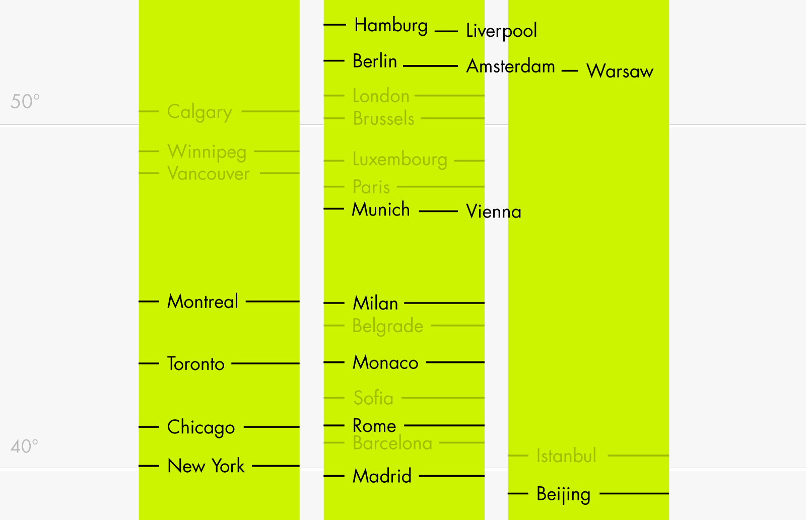

# datavis-latitudes

For my blog article [Which Cities Are On Similar Latitudes?](http://lisacharlotterost.github.io/2016/06/23/flatland/).

Scraped the data from geonames.org
plotted it with R and ggplot2
then tweaked it with Adobe Illustrator

From my blog:
"Yesterday afternoon I worked on a small project: I got rid of these annoying things called longitudes and just showed the latitudes of cities and continent borders on a graphic. I published it on Twitter and got TONS of feedback. Some people said that the cities are an odd selection, they wanted to know why I picked Paris over Rome, and some wanted a “‘add your city to this chart’ function”. Well, I’m not a fan of that. But I did extend on the original graphic a little bit, to do more justice to more cities.

If somebody wants to tweak these versions etc, go ahead. It’s all Creative Commons (BY-NC-SA). Here is the data I used for this graphic; pulled from geonames.org. It contains the ten biggest cities for each country."
