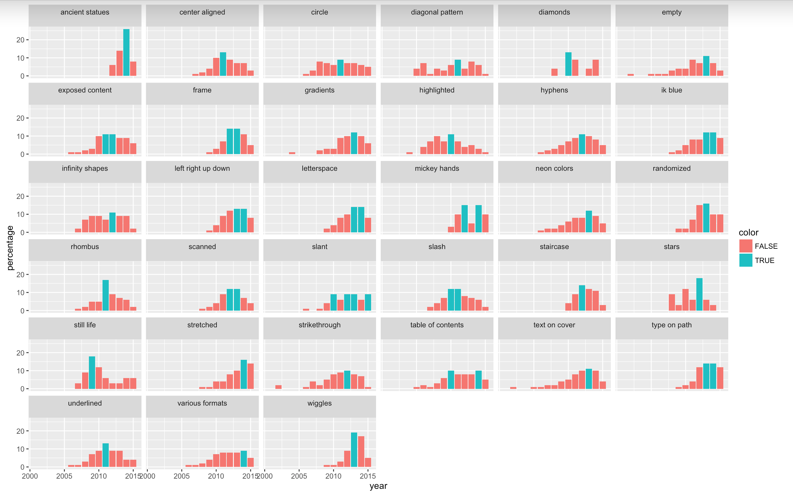

# datavis-trendlist
Scraping the data for each year for all trends from [trendlist.org](http://www.trendlist.org/trends) with BeautifulSoup and visualising it with R

Quick project to learn more about BeautifulSoup and R. I initially thought it would be interesting to see which trends peaked in which year, but I don't have any information about how many entries Trendlist processes each year.

The vis shows all the trends that trendlist.org tracks in graphic design from 2000 to 2016. Green bars indicate the peak year of each trend.
