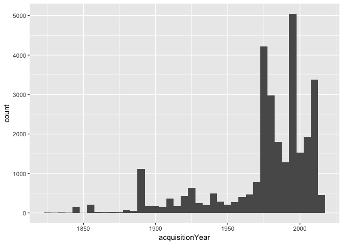
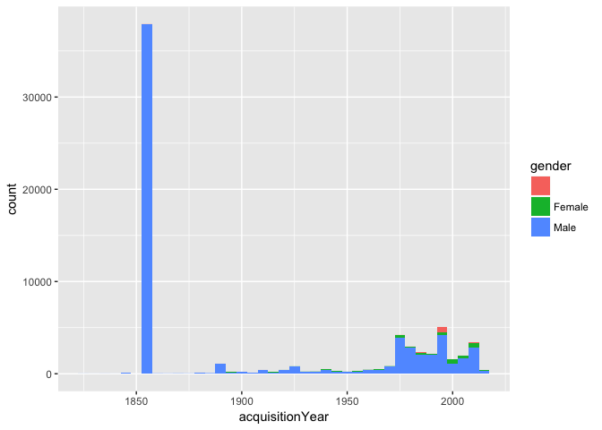
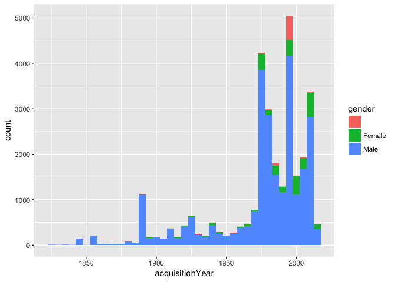
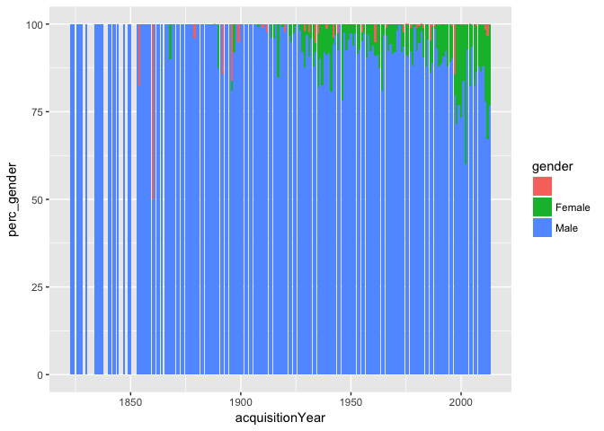

The Tate collection: How many artworks were created by women?
================

Set up
------

We'll need some R libraries, and we'll install them with the library "needs"

``` r
# install.packages("needs")
library(needs)
needs(dplyr, ggplot2, reshape2)
```

We also need the data. The two csv come directly from here: Source: <https://github.com/tategallery/collection>

``` r
# read the data
artists <-  read.csv("~/Desktop/artist_data.csv")
art <-  read.csv("~/Desktop/artwork_data.csv")
```

The first plot!
---------------

We want to answer the question in which years Tate aquired how many artworks, and if the artist of these aquired artworks were male or female.

Our csv "artwork\_data.csv" can answer the first question:

``` r
# plot a histogram of the acquisition year of all Tate artworks
ggplot(art, aes(acquisitionYear)) + geom_histogram(binwidth=5)
```

    ## Warning: Removed 45 rows containing non-finite values (stat_bin).


The problem with Turner
-----------------------

We can see that the Tate aquired tons of artworks by Joseph Mallord William Turner in 1856. Let's see what's up with that. A quick Internet search leads us to the Tate website, which states: "After J.M.W. Turner???s death in 1851, the contents of his studio became the property of the nation. The Turner Bequest comprises around 30,000 works of art on paper, including watercolours, drawings and 300 oil paintings." (<http://www.tate.org.uk/research/prints-and-drawings-rooms/turner-bequest>)

Let's see if the number adds up:

``` r
# get a sorted list of which artist has the most artworks in the tate
# one way to do this is a plain summary: 
# summary(art$artist)

# another way is to use dplyr, and group by artists 
# and count all entries of each group.
# "count" will do that for us:

art %>% 
  count(artist,sort=TRUE)
```

    ## # A tibble: 3,336 × 2
    ##                            artist     n
    ##                            <fctr> <int>
    ## 1  Turner, Joseph Mallord William 39389
    ## 2                   Jones, George  1046
    ## 3            Moore, Henry, OM, CH   623
    ## 4                Daniell, William   612
    ## 5                   Beuys, Joseph   578
    ## 6              British (?) School   388
    ## 7           Paolozzi, Sir Eduardo   385
    ## 8                   Flaxman, John   287
    ## 9               Phillips, Esq Tom   274
    ## 10                   Warhol, Andy   272
    ## # ... with 3,326 more rows

Seems like the Tate owns not around 30,300 works by Turner, but almost 40,000. But maybe they were not all aquired in the same year?

``` r
# get a dataframe of only artworks by Turner 
# do a count on the aquisition year:

art %>% 
  filter(artist == "Turner, Joseph Mallord William") %>%
  count(acquisitionYear,sort=TRUE)
```

    ## # A tibble: 28 × 2
    ##    acquisitionYear     n
    ##              <int> <int>
    ## 1             1856 37711
    ## 2             1988   791
    ## 3             1986   474
    ## 4             1925   154
    ## 5             1989    57
    ## 6             1987    53
    ## 7             1992    33
    ## 8               NA    28
    ## 9             1990    21
    ## 10            1984    20
    ## # ... with 18 more rows

Well, seems like there will still more than 30,300 art works aquired in 1856. As we've seen, this gives us a really distorted view on the data. Let's get rid of our admired Turner for a while and then plot the graph again:

``` r
# filter Turner out of the data 
noturner = art %>% 
  filter(artist != "Turner, Joseph Mallord William")

# plot a histogram of the acquisition year of all Tate artworks, 
# except the one from Turner
ggplot(noturner, aes(acquisitionYear)) + geom_histogram(binwidth=5)
```

    ## Warning: Removed 17 rows containing non-finite values (stat_bin).



That's better! Now we can see that the Tate aquired on average more and more ofter the years. We can get the numbers for that, too:

``` r
# get the years in which the most art works were aquired, 
# except the ones from Turner

noturner %>% 
  count(acquisitionYear, sort = TRUE)
```

    ## # A tibble: 179 × 2
    ##    acquisitionYear     n
    ##              <int> <int>
    ## 1             1997  3702
    ## 2             1975  3046
    ## 3             2009  1364
    ## 4             1979  1166
    ## 5             1888  1060
    ## 6             2008   787
    ## 7             1996   680
    ## 8             2004   643
    ## 9             1976   607
    ## 10            1982   597
    ## # ... with 169 more rows

Now that we know how many artworks the Tate acquired per year, let's look at the gender split. To do so, we need to merge the "art"-dataframe with the "artist"-dataframe, based on the ID of the artist:

``` r
# rename the ID in "artists" to "artistID"
artists <- artists %>% rename(artistId = id)

# merge the two dataframes
data <- merge(art, artists, by="artistId")
```

Finding out the share of artworks for each gender
-------------------------------------------------

So how many acquired artworks are created by women, in percentage?

``` r
# calculate the percentage 
data %>%
  mutate(count_total = n()) %>%
  group_by(gender) %>% 
  mutate(count_per_gender = n(),
         perc_gender = 100/count_total*count_per_gender) %>%
  group_by(gender,perc_gender) %>%
  summarise()
```

    ## Source: local data frame [3 x 2]
    ## Groups: gender [?]
    ## 
    ##   gender perc_gender
    ##   <fctr>       <dbl>
    ## 1           1.002963
    ## 2 Female    3.941036
    ## 3   Male   95.056001

So including Turner, 4% of the artworks were created by women. And how many acquired artworks are created by women when we ignore Turner?

``` r
# calculate the percentage and ignore Turner
data %>%
  filter(artist != "Turner, Joseph Mallord William") %>%
  mutate(count_total = n()) %>%
  group_by(gender) %>% 
  mutate(count_per_gender = n(),
         perc_gender = 100/count_total*count_per_gender) %>%
  group_by(gender,perc_gender) %>%
  summarise()
```

    ## Source: local data frame [3 x 2]
    ## Groups: gender [?]
    ## 
    ##   gender perc_gender
    ##   <fctr>       <dbl>
    ## 1           2.328390
    ## 2 Female    9.149165
    ## 3   Male   88.522445

Definitely more! 9% of the artworks were created by women, if we exclude Turner.

How can we show the results?
----------------------------

Now we can plot our first histogram that shows it:

``` r
# plot histogram
ggplot(data, aes(acquisitionYear)) + 
  geom_histogram(aes(fill=gender),binwidth = 5)
```

    ## Warning: Removed 45 rows containing non-finite values (stat_bin).



Since Turner destroys our absolute values, let's plot the data without Turner:

``` r
# exclude Turner from the data
data_withoutTurner = data %>%
  filter(artist != "Turner, Joseph Mallord William")

# plot histogram
ggplot(data_withoutTurner, aes(acquisitionYear)) + 
  geom_histogram(aes(fill=gender),binwidth = 5)
```

    ## Warning: Removed 17 rows containing non-finite values (stat_bin).



If we want to include Turner, we can also look at the relative values instead:

``` r
# calculate the percentages per gender
art_gender = data %>% 
  group_by(acquisitionYear) %>% 
  mutate(count_per_year = n()) %>% 
  group_by(acquisitionYear,gender) %>% 
  mutate(count_per_year_gender = n(),
         perc_gender = 100/count_per_year*count_per_year_gender) %>%
  group_by(acquisitionYear,gender,perc_gender) %>%
  summarise()

# plot the result
ggplot(art_gender, aes(x=acquisitionYear, y=perc_gender)) + 
  geom_col(aes(fill=gender))
```

    ## Warning: Removed 2 rows containing missing values (position_stack).



That looks good!

When we plot our data over time, we want to make sure that all our data entries actually have a time. So how many artworks don't have a date? Let's count them, to give that information in our chart:

``` r
# count all art works that have blank values as year
data %>% 
  filter(acquisitionYear == "") %>%
  count(sort = TRUE)
```

    ## # A tibble: 1 × 1
    ##       n
    ##   <int>
    ## 1     0

Wheee, all artworks have an acquisition year! That's great news.

Understading artists with unknown gender
----------------------------------------

What's up with these artworks that neither come from a female nor male artist? Let's count them, to see how big the problem is:

``` r
# count all art works that have blank values as gender
data %>% 
  filter(gender == "" ) %>%
  count()
```

    ## # A tibble: 1 × 1
    ##       n
    ##   <int>
    ## 1   694

Let's get a list of them:

``` r
# count all art works that have blank values as gender
# and sort them by artist
data %>% 
  filter(gender == "" ) %>%
  count(artist, sort = TRUE)
```

    ## # A tibble: 49 × 2
    ##                                                                    artist
    ##                                                                    <fctr>
    ## 1                                                      British (?) School
    ## 2                                             British School 18th century
    ## 3                                             British School 19th century
    ## 4                                                                Highmore
    ## 5                                             British School 17th century
    ## 6                                       Langlands and Bell, Ben and Nikki
    ## 7  Art & Language (Terry Atkinson, born 1939; Michael Baldwin, born 1945)
    ## 8     Art & Language (Michael Baldwin, born 1945; Mel Ramsden, born 1944)
    ## 9                                                                Lairesse
    ## 10                                              Martin, J., of Canterbury
    ## # ... with 39 more rows, and 1 more variables: n <int>

We can see that most of them come from the "British school". There are really some artworks in the Tate for which that is the "painter": <https://www.tate.org.uk/art/artists/british-school-19th-century-60>

We can see that in our chart, there is a high percentage of artworks from artists with unknown gender in 1854 and 1860. We should explain them in the chart.

``` r
# count all art works that were acquired in either 1860 or 1854
# and sort them by artist
data %>% 
  filter(acquisitionYear == "1860" | acquisitionYear == "1854") %>%
  count(artist, gender, acquisitionYear) %>%
  arrange(desc(acquisitionYear))
```

    ## Source: local data frame [9 x 4]
    ## Groups: artist, gender [9]
    ## 
    ##                        artist gender acquisitionYear     n
    ##                        <fctr> <fctr>           <int> <int>
    ## 1 British School 19th century                   1860     1
    ## 2             Williams, Penry   Male            1860     1
    ## 3     Barker, Thomas, of Bath   Male            1854     1
    ## 4 British School 18th century                   1854     3
    ## 5       Taylor, John, of Bath   Male            1854     1
    ## 6  Turner, William, of Oxford   Male            1854     3
    ## 7           Wilkie, Sir David   Male            1854     1
    ## 8             Wilson, Richard   Male            1854     7
    ## 9                   Wyck, Jan   Male            1854     1

Seems like the Tate only acquired two works in 1860, and one of them was from the British School.

I think that's sufficient for our chart! We should have a good overview now of the data. Let's bring the data in the right format and export.

Prepare the data for Datawrapper
--------------------------------

Now we want to reshape the data, so that we can use it in Datawrapper. For that, we will just need the share of artworks from male, female and gender-unknown artists. Since there are many years in which the Tate acquired no artworks from female or gender-unknown artists, we will have lots of NA values. To correctly display the data in Datawrapper, we replace them with an zero.

``` r
# bring the data from the long format into a wide format
art_gender_wide <- dcast(art_gender, acquisitionYear ~ gender)
```

    ## Using perc_gender as value column: use value.var to override.

``` r
# replace na's with zeros
art_gender_wide = art_gender_wide %>%
  replace(., is.na(.), 0)

# write the csv to be imported in Datawrapper
write.csv(art_gender_wide, "art_gender_wide.csv")
```
